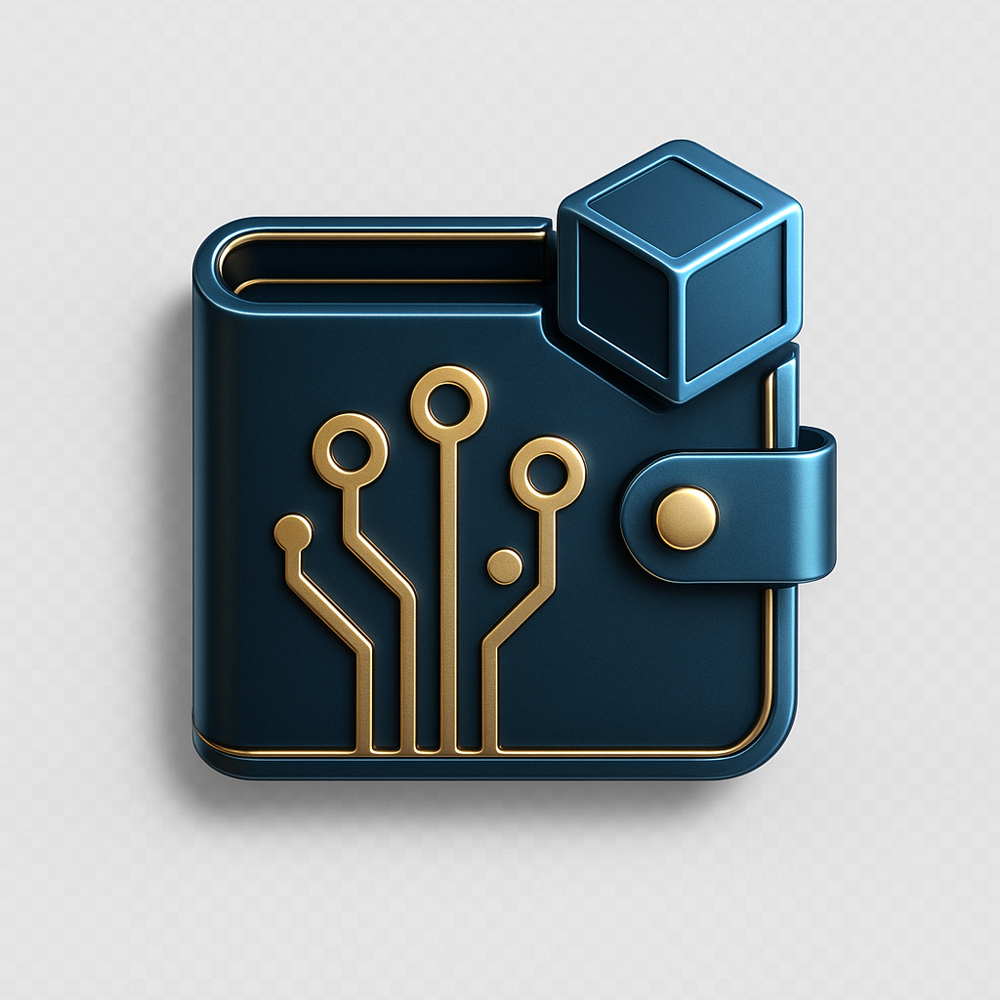

# Ultimate CLI Wallet GUI 💰

**Created by: Magnafic0 unchained & Gistgard Reventlov**

A comprehensive multi-coin wallet manager with programmable buttons, wallet.dat support, and seed phrase management.



## 🌟 Features

### 💰 Wallet Manager
- ✅ Multi-coin support - Pre-configured for 12+ popular coins
- ✅ Add/Import/Export wallets
- ✅ wallet.dat support
- ✅ Real-time balance display
- ✅ All CLI commands as buttons
- ✅ Address management
- ✅ Encryption/decryption

### 💸 Transaction Manager
- ✅ Send transactions with GUI form
- ✅ Transaction history viewer
- ✅ Fee calculation
- ✅ Address validation
- ✅ Transaction confirmation
- ✅ TXID copying

### ⛏️ Mining Integration
- ✅ Start/stop mining buttons
- ✅ Mining status monitoring
- ✅ Mining output console
- ✅ Thread configuration
- ✅ Pool integration ready

### 🔧 Advanced Tools
- ✅ Seed phrase generator/validator
- ✅ Address tools and QR codes
- ✅ Custom command console
- ✅ Backup/restore functions
- ✅ Private key import/export
- ✅ Wallet encryption

### ⚠️ Programmable Features
- ✅ Custom coin configuration
- ✅ Programmable buttons for any CLI command
- ✅ Batch operations
- ✅ Auto-backup settings
- ✅ Multi-wallet support

### 🎨 User Interface
- ✅ Beautiful light blue theme
- ✅ Dynamic coin logo display
- ✅ Intuitive tabbed interface
- ✅ Professional styling
- ✅ Easy-to-read console

## 📋 Pre-configured Coins

The GUI comes pre-configured with support for **23 major cryptocurrencies**:

### Tier 1 - Major Coins
1. **Bitcoin** (BTC) - The original cryptocurrency
2. **Ethereum** (ETH) - Smart contract platform
3. **Litecoin** (LTC) - Silver to Bitcoin's gold
4. **Bitcoin Cash** (BCH) - Bitcoin fork with larger blocks
5. **Monero** (XMR) - Privacy-focused cryptocurrency

### Tier 2 - Popular Altcoins
6. **Dogecoin** (DOGE) - The meme coin that became serious
7. **Zcash** (ZEC) - Privacy with zero-knowledge proofs
8. **Dash** (DASH) - Digital cash with instant transactions
9. **Ravencoin** (RVN) - Asset transfer blockchain
10. **Vertcoin** (VTC) - ASIC-resistant mining
11. **Groestlcoin** (GRS) - Fast & private transactions
12. **Digibyte** (DGB) - Secure & fast blockchain

### Tier 3 - Next Generation
13. **Aleo** (ALEO) - Zero-knowledge privacy platform
14. **Cardano** (ADA) - Proof-of-stake blockchain
15. **Solana** (SOL) - High-performance blockchain
16. **Polkadot** (DOT) - Multi-chain protocol
17. **Avalanche** (AVAX) - Fast smart contracts platform
18. **Cosmos** (ATOM) - Internet of blockchains
19. **Algorand** (ALGO) - Pure proof-of-stake
20. **Tezos** (XTZ) - Self-amending blockchain
21. **Stellar** (XLM) - Cross-border payments
22. **Kaspa** (KAS) - BlockDAG architecture
23. **Ergo** (ERG) - Proof-of-work smart contracts

You can easily add more coins through the GUI!

## 🚀 Installation

### Requirements

- Python 3.6 or higher
- Tkinter (usually included with Python)
- Coin daemon/CLI installed for the coins you want to use

### Linux/macOS

```bash
# Install Python and Tkinter (if not already installed)
# Ubuntu/Debian:
sudo apt-get install python3 python3-tk

# Fedora:
sudo dnf install python3 python3-tkinter

# macOS (Tkinter included):
# Install Python from python.org or use Homebrew
brew install python3

# Make launcher executable
chmod +x launch_wallet.sh

# Run the GUI
./launch_wallet.sh
```

### Windows

```cmd
# Install Python from python.org (Tkinter included)
# Double-click wallet_gui.py or run:
python wallet_gui.py
```

## 📖 Usage Guide

### Getting Started

1. **Launch the application**
   ```bash
   ./launch_wallet.sh
   ```

2. **Select your coin** from the dropdown menu at the top

3. **Make sure the coin daemon is running** before using wallet functions

### Wallet Tab

The **Wallet** tab provides core wallet management:

- **Get Balance**: Display current wallet balance
- **List Addresses**: Show all wallet addresses
- **New Address**: Generate a new receiving address
- **Import Address**: Import an existing address
- **Encrypt Wallet**: Encrypt wallet with passphrase
- **Unlock/Lock Wallet**: Manage wallet encryption
- **Backup Wallet**: Create wallet.dat backup
- **Dump/Import Privkey**: Export/import private keys

### Transaction Tab

The **Transactions** tab handles sending and viewing transactions:

- **Send Transaction Form**:
  - Enter recipient address
  - Enter amount to send
  - Optional: Set custom fee
  - Optional: Add comment
  - Click "Send Transaction"

- **Transaction History**:
  - View recent transactions
  - See confirmations
  - Copy transaction IDs
  - Refresh list

### Mining Tab

The **Mining** tab provides mining controls:

- **Start Mining**: Begin mining with specified threads
- **Stop Mining**: Stop mining operations
- **Mining Info**: View current mining statistics
- **Mining Output**: Real-time mining console

### Tools Tab

The **Tools** tab offers advanced utilities:

- **Seed Phrase Tools**:
  - Generate new seed phrases
  - Validate existing seeds
  - Restore wallet from seed

- **Address Tools**:
  - Validate addresses
  - Get address information
  - Generate QR codes

- **Backup & Restore**:
  - Backup current wallet
  - Restore from backup
  - Backup all wallets

### Console Tab

The **Console** tab provides direct CLI access:

- Type any CLI command
- Execute with Enter or "Execute" button
- Quick command buttons for common operations
- Full command history in output window

## ⚙️ Configuration

### Adding Custom Coins

1. Go to **Tools** → **Add Custom Coin**
2. Fill in the coin details:
   - **Coin Name**: Display name
   - **CLI Command**: Command-line tool (e.g., `bitcoin-cli`)
   - **Daemon Command**: Daemon process (e.g., `bitcoind`)
   - **Data Directory**: Wallet data location
   - **RPC Port**: RPC port number
3. Click **Save**

### Configuration File

Settings are stored in `~/.wallet_gui_config.json`:

```json
{
  "coins": {
    "Bitcoin": {
      "cli": "bitcoin-cli",
      "daemon": "bitcoind",
      "datadir": "/home/user/.bitcoin",
      "port": 8332
    }
  },
  "current_coin": "Bitcoin",
  "auto_backup": true,
  "backup_dir": "/home/user/wallet_backups"
}
```

You can manually edit this file to customize settings.

## 🔐 Security Best Practices

1. **Always backup your wallet** before making changes
2. **Keep seed phrases secure** - write them down and store safely
3. **Use strong passphrases** for wallet encryption
4. **Verify addresses** before sending transactions
5. **Keep private keys private** - never share them
6. **Test with small amounts** first
7. **Keep software updated** - use latest coin daemon versions

## 🛠️ Troubleshooting

### "CLI not found" error

- Make sure the coin daemon/CLI is installed
- Verify the CLI command in coin configuration
- Check that the CLI is in your system PATH

### "Connection refused" error

- Make sure the coin daemon is running
- Check RPC port configuration
- Verify datadir path is correct

### "Wallet locked" error

- Unlock wallet using "Unlock Wallet" button
- Enter correct passphrase
- Set appropriate timeout

### GUI doesn't start

- Check Python 3 is installed: `python3 --version`
- Check Tkinter is installed: `python3 -c "import tkinter"`
- Install missing dependencies

## 📝 Command Examples

### Common CLI Commands

```bash
# Get wallet info
getinfo

# Get balance
getbalance

# List transactions
listtransactions

# Get new address
getnewaddress

# Send transaction
sendtoaddress <address> <amount>

# Get block count
getblockcount

# Get peer info
getpeerinfo

# Get mining info
getmininginfo

# Start mining
setgenerate true 1

# Stop mining
setgenerate false
```

## 🔧 Advanced Features

### Batch Operations

Use the console tab to execute multiple commands:

```bash
# Generate 10 addresses
getnewaddress "addr1"
getnewaddress "addr2"
...
```

### Custom Buttons

You can modify the source code to add custom buttons for frequently used commands.

### Wallet Automation

The GUI can be extended with Python scripts for automated operations.

## 📦 File Structure

```
ultimate-cli-wallet-gui/
├── wallet_gui.py          # Main application
├── launch_wallet.sh       # Launch script
├── README.md             # This file
└── ~/.wallet_gui_config.json  # Configuration (created on first run)
```

## 🤝 Contributing

This is an open-source project. Feel free to:

- Add support for more coins
- Improve the UI/UX
- Add new features
- Fix bugs
- Improve documentation

## ⚠️ Disclaimer

This software is provided "as is" without warranty. Use at your own risk. Always:

- Test with small amounts first
- Keep backups of your wallets
- Verify transactions before sending
- Keep your private keys secure

## 📄 License

MIT License - Free to use, modify, and distribute.

## 🆘 Support

For issues or questions:

1. Check the troubleshooting section
2. Review coin-specific documentation
3. Check daemon logs for errors
4. Verify configuration settings

## 🎯 Roadmap

Future features planned:

- [ ] Multi-wallet support in single view
- [ ] Price ticker integration
- [ ] Portfolio tracking
- [ ] Exchange integration
- [ ] Hardware wallet support
- [ ] Mobile companion app
- [ ] Automated trading features
- [ ] Tax reporting tools

## 🙏 Credits

**Created by:**
- **Magnafic0 unchained**
- **Gistgard Reventlov**

Built with Python and Tkinter for maximum compatibility and ease of use.

Special thanks to the cryptocurrency community and all the amazing blockchain projects that make this tool possible!

---

**Happy Wallet Managing! 💰🚀**

*Ultimate CLI Wallet GUI v2.0 - Supporting 23+ cryptocurrencies*
